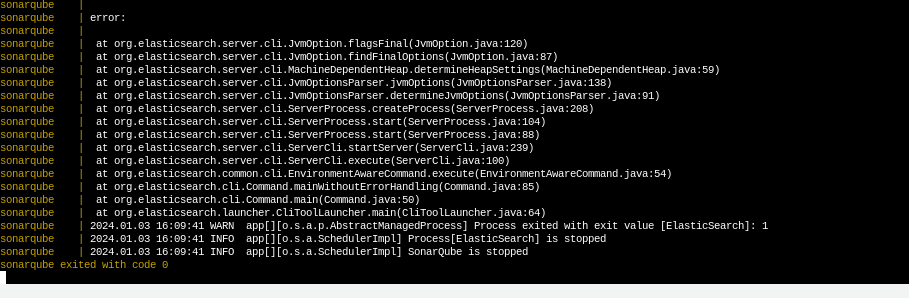

# ERRORS FACED

# SONARQUBE ISSUE FACED




To fix this error, [sonarqube-requirements](https://docs.sonarsource.com/sonarqube/9.9/requirements/prerequisites-and-overview/) and then this could be the issue:

```sh
sudo sysctl -w vm.max_map_count=262144
```
---

Indefinite loading of Sonarqube. This error was fixed by installing apache2. 

```sh
sudo apt install apache2
```
